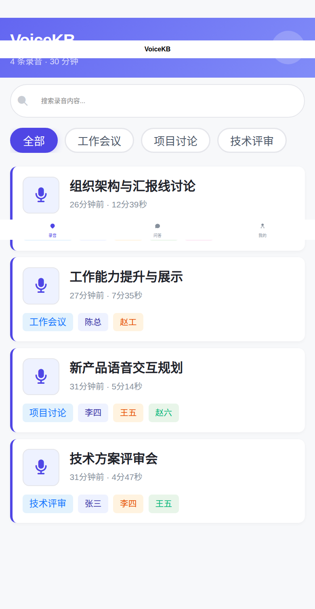
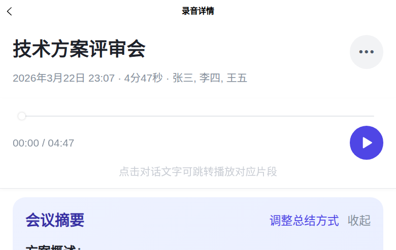
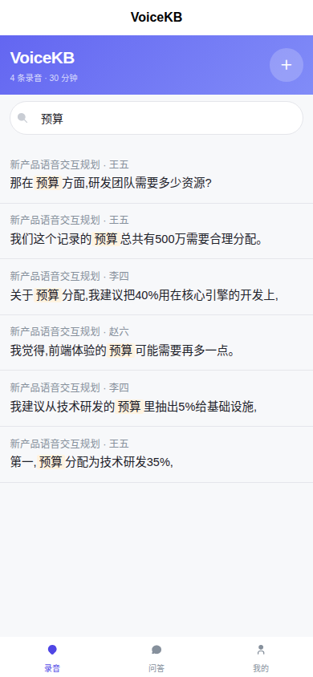
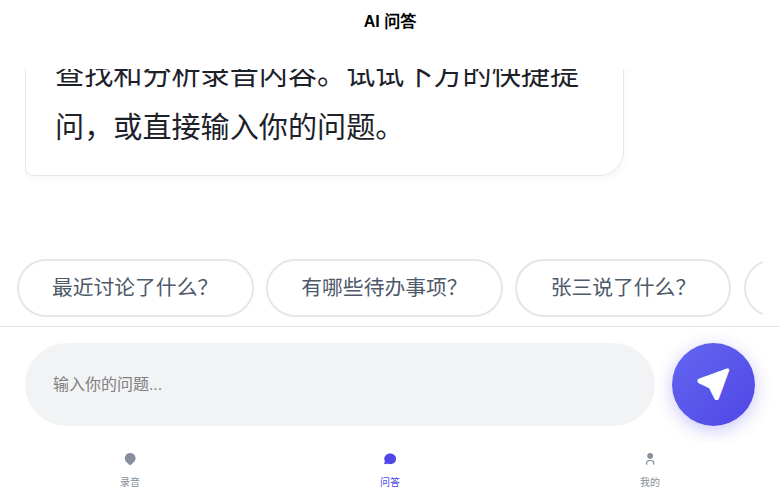

<h1 align="center">
  <br>
  VoiceKB
  <br>
</h1>

<h4 align="center">Turn everyday recordings into a searchable, conversational personal knowledge base</h4>

<p align="center"><a href="README_zh.md">中文文档</a></p>

<p align="center">
  
  
  
  
</p>

<p align="center">
  
  
  
  
</p>

---

## What It Does

Upload a recording and VoiceKB handles the rest automatically:

| Capability | Description |
|------------|-------------|
| **Speech Recognition** | Powered by faster-whisper with high Chinese accuracy — GPU processes a 30-minute recording in under 5 minutes |
| **Speaker Diarization** | Automatically identifies who said what, and recognizes the same speaker across multiple recordings (voice fingerprint linking) |
| **Smart Summarization** | LLM generates meeting minutes automatically; supports per-category custom summary templates |
| **Dual-engine Search** | Exact keyword matching + semantic vector search to locate content quickly |
| **AI Q&A** | Ask questions about your recordings directly, with multi-turn dialogue and source citations |
| **Dual Transcript Versions** | Raw ASR output alongside an LLM-polished fluent version, switchable with one tap |

## Key Innovations

- **Cross-recording Voice Fingerprint Linking** — Speaker identity is tracked not just within a single recording, but across your entire library. Label a speaker once, and they are recognized automatically in every recording.
- **Three-tier Prompt System** — Platform default → category-level customization → per-recording override. Every layer of summarization behavior is adjustable.
- **Summarization + Polishing in Parallel** — `asyncio.gather` runs LLM summarization and text polishing concurrently, cutting processing time in half.
- **Fully Local Deployment** — ASR, voice fingerprinting, vector search, and LLM all run on your own server. Your recordings never leave your machine.

## Architecture

```
┌─────────────────────────────────────────────┐
│  Consumer    uni-app H5 / Mini Program / REST API  │
├─────────────────────────────────────────────┤
│  Knowledge   SQLite FTS5 + ChromaDB + LLM RAG      │
├─────────────────────────────────────────────┤
│  Processing  faster-whisper + pyannote.audio + wespeaker│
├─────────────────────────────────────────────┤
│  Storage     SQLite + Markdown dual-write           │
└─────────────────────────────────────────────┘
```

## Quick Start

### Prerequisites

- Python 3.11+
- Node.js 18+ (for frontend build)
- 8 GB+ RAM
- GPU optional (10× faster with GPU; works on CPU too)

### 1. Backend

```bash
git clone https://github.com/dadiyang/voicekb.git
cd voicekb
python3 -m venv venv && source venv/bin/activate
pip install -r requirements.txt
cp .env.example .env  # edit as needed
```

### 2. Frontend

```bash
cd client
npm install
npx uni build -p h5
cd ..
```

The built H5 files are in `client/dist/build/h5/` and served automatically by the backend.

### 3. Start

```bash
PYTHONPATH=src python -m uvicorn voicekb.api.app:app --host 0.0.0.0 --port 8080
```

Open `http://<server-ip>:8080` in your mobile browser to get started.

## Deployment Modes

VoiceKB supports two deployment modes — choose based on your hardware:

### Mode A: With GPU — Fully Local (Recommended)

All computation runs locally; zero data egress. Requires an NVIDIA GPU (4 GB+ VRAM).

```bash
# .env
VOICEKB_WHISPER_DEVICE=cuda
VOICEKB_LLM_BASE_URL=http://localhost:18090/v1
VOICEKB_LLM_MODEL=Qwen/Qwen3-8B
VOICEKB_LLM_API_KEY=not-needed
```

For local LLM, we recommend deploying Qwen3-8B via [vLLM](https://github.com/vllm-project/vllm) or [Ollama](https://ollama.ai).

### Mode B: Without GPU — CPU + Cloud LLM

ASR and speaker diarization run on CPU (slower but functional); LLM calls go to a cloud API.

```bash
# .env
VOICEKB_WHISPER_DEVICE=cpu
VOICEKB_LLM_BASE_URL=https://api.deepseek.com/v1   # or Qwen, OpenAI, etc.
VOICEKB_LLM_MODEL=deepseek-chat
VOICEKB_LLM_API_KEY=sk-your-api-key
```

> Any service compatible with the OpenAI Chat Completions API works out of the box — no code changes required.

### Performance Comparison

| Stage | GPU (RTX 3060+) | CPU |
|-------|-----------------|-----|
| ASR — 30-minute recording | ~3 min | ~30 min |
| Speaker diarization | ~10 sec | ~30 sec |
| LLM summarization (local 8B) | ~15 sec | N/A (cloud API ~5 sec) |

## Configuration

Configure via `.env` file or environment variables (prefix `VOICEKB_`):

| Variable | Default | Description |
|----------|---------|-------------|
| `WHISPER_MODEL` | `small` | Whisper model size (`small` / `medium` / `large-v3`) |
| `WHISPER_DEVICE` | `cuda` | Compute device (`cuda` / `cpu`) |
| `LLM_BACKEND` | `openai_compatible` | LLM backend (`openai_compatible` / `none`) |
| `LLM_BASE_URL` | `http://localhost:8000/v1` | LLM API endpoint |
| `LLM_MODEL` | `Qwen/Qwen3-8B` | Model name |
| `LLM_API_KEY` | `not-needed` | API key (not required for local deployment) |
| `PORT` | `8080` | Service port |

## Tech Stack

| Layer | Technology |
|-------|------------|
| Frontend | uni-app (Vue 3) — compiles to both H5 and WeChat Mini Program |
| Backend | FastAPI + SQLite + ChromaDB |
| ASR | faster-whisper (CTranslate2 optimized) |
| Speaker | pyannote.audio 3.1 (neural segmentation + wespeaker embeddings) |
| Vector Search | ChromaDB + bge-small-zh-v1.5 |
| LLM | Pluggable — local Qwen3-8B or any OpenAI-compatible API |

## License

[Apache-2.0](LICENSE)
